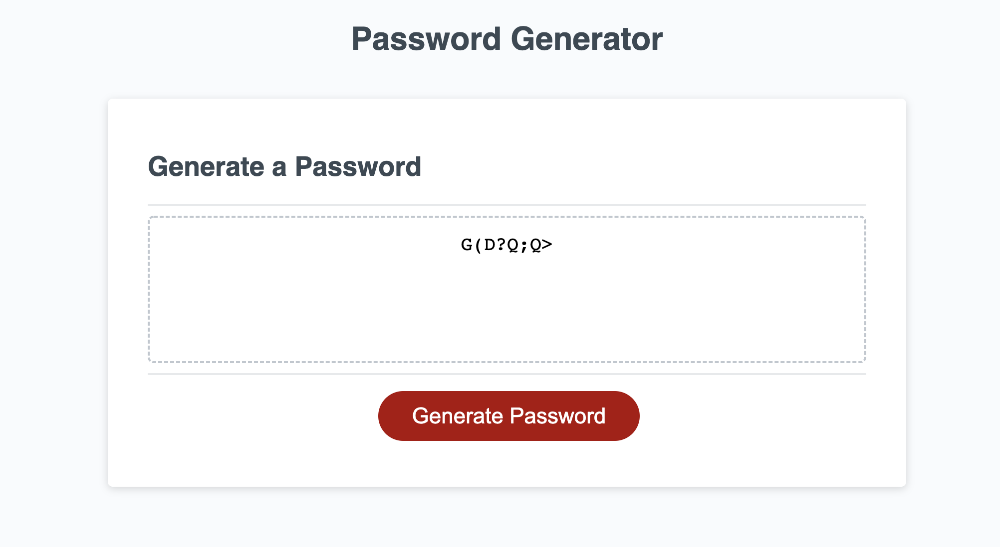

## Password Generator 

This password generator is used to generate a random password based on the criteria the user specifies. The options are to generate a password that includes numbers, upper and lower case letters and special characters

## Technology Used

* Javascript
* HTML
* CSS

## Preview

  

<a href= "https://gnorzea.github.io/Password-Generator/"> Deployed Link on GitHub</a>